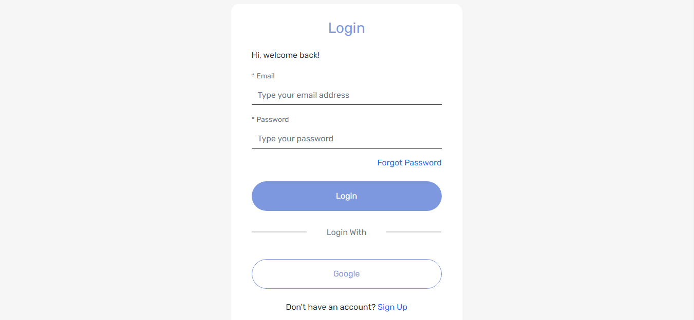
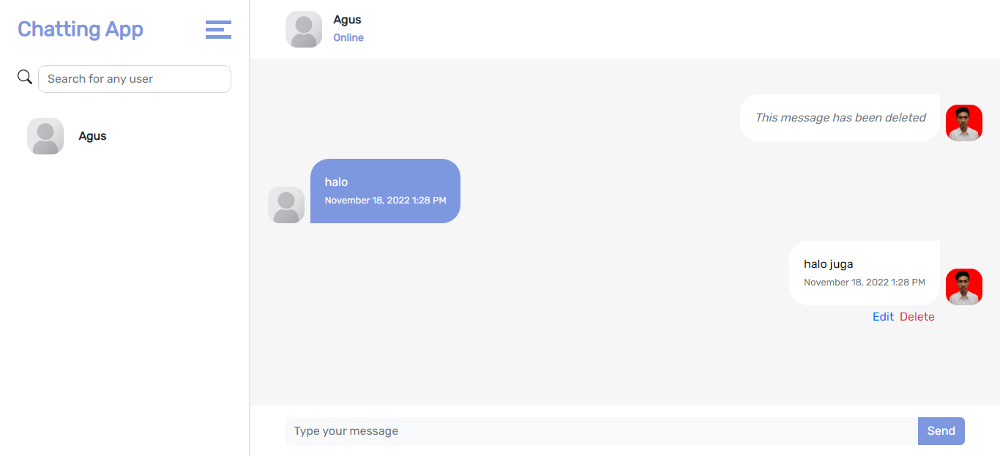
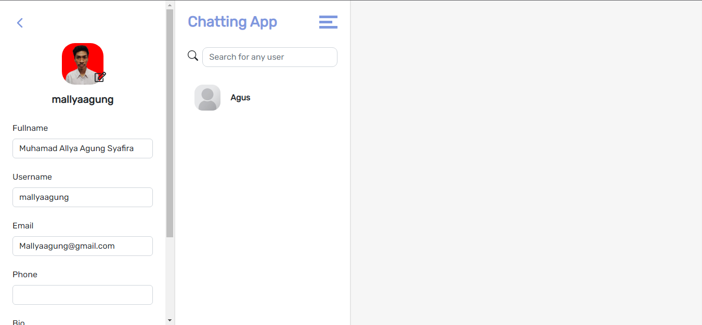
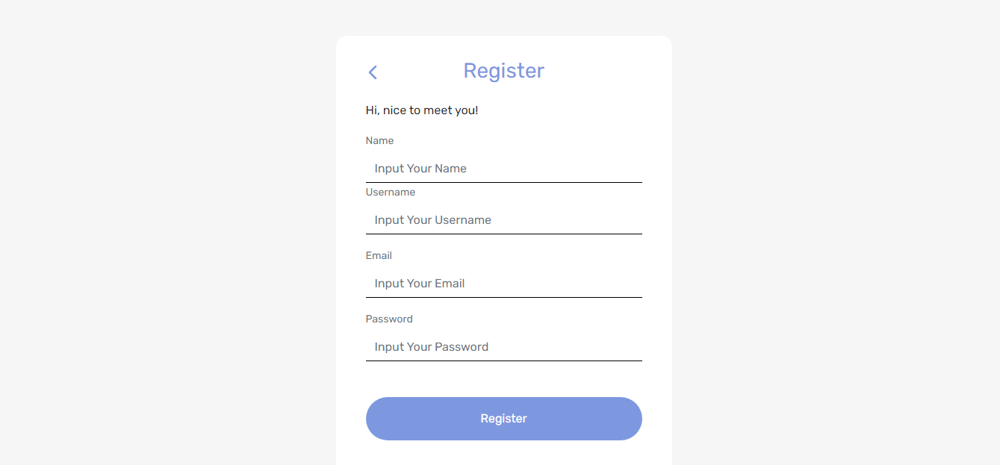

# Telegrams App

Telegrams App is an web application where you can chat like using Whatsapp.

## Framework

[ReactJS](https://reactjs.org)
[Socket.IO](https://socket.io)
[Express.JS](https://expressjs.com)

## Usage

First you need to clone the repositories.

```bash
git clone https://github.com/mallyaagung/telegrams-fe.git
```

After that run this command to install all the package needed.

```bash
npm install
```

Then, to run the app use this command

```bash
npm run start
```

## Demo

To use this app use this link

[Demo](https://telegrams-fe.vercel.app)

## Screenshot





